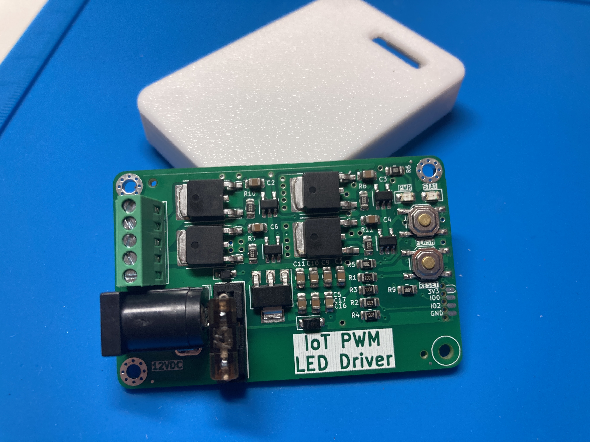
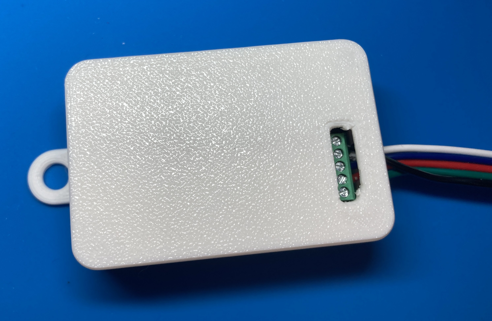
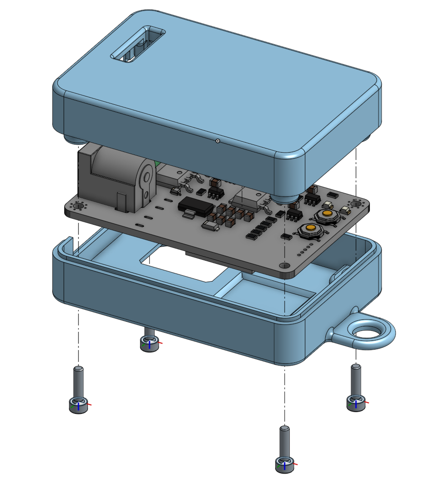

# IoT driver for "Dumb" 5050 RGB LED Strips
ESP8266-based LED Driver designed to work with WLED and cheap 12V barrel-jack power supplies for accent lighting around the home. 

This driver was designed to allow network-enabled control of almost any 12V "dumb" strip around, from plain white to FCOB strips to RGBW. 

My v1.0 worked perfectly, so I'm going to leave it as-is. The only upgrades I'd make at this point are: 
1) WLED announced that they're deprecating ESP8266 support right after I ordered v1.0, but for driving a single color the ESP8266 should be more than enough. 
2) There's some whine from the Power mosfet drivers, but it's barely noticable and not really worth addressing unless I was already doing a redesign. 

***See [Releases](https://github.com/0xjmux/iot_pwm_leddriver/releases) for all the necessary files and information to make your own!***

### Features
* Uses mini blade fuses for overcurrent protection and to protect against fire hazard from shorts on bad quality LED strips
* Board designed to handle up to and above maximum expected from most LED strips (8A)
* 4 channels to handle RGBW: or up to 4 single-color strips
* Terminal block for ease of use connecting strips and a 2.1mm jack allowing use of cheap 12V supplies you have lying around
* Capable of both programming and debug over [SOICbite Connector](https://github.com/SimonMerrett/SOICbite).
* Includes status and power LEDs and board overvoltage protection

* See [ABOUT.md](./ABOUT.md) for some information about design goals and the project. 

#### Pinout 

| Output     | ESP Pin |
| -----      | ------  |
| LED_R      | GPIO 5  |
| LED_G      | GPIO 13 |
| LED_B      | GPIO 14 |
| LED_W      | GPIO 12 |
| STATUS LED | GPIO 16 |

#### Case
I also designed a 3D printable case, which can be found under [case/](case/). The screw terminals are still easily accessible, and there's a window on the bottom so you can see the board name and version without having to open it. 
* The case uses M2x8mm screws to hold the two halves together, and is designed to be printed in PLA with 10% infill. 

### v1.0 - First try works!
* Complete redesign from v0.2, with a focus on overall system design and ease of setup for the end user. 
* Uses mini blade fuses for overcurrent protection and to protect against fire hazard from shorts on bad quality LED strips
* Board designed to handle up to and above maximum expected from most LED strips (8A)
* 4 channels to handle RGBW: or up to 4 single-color strips
* Terminal block for ease of use connecting strips and a 2.1mm jack allowing use of cheap 12V supplies you have lying around
* Capable of both programming and debug over [SOICbite Connector](https://github.com/SimonMerrett/SOICbite).
* Includes status and power LEDs and board overvoltage protection

### v0.1 - Quick Board Mock-up
* My first 4 layer board! But some improvement still possible
 

