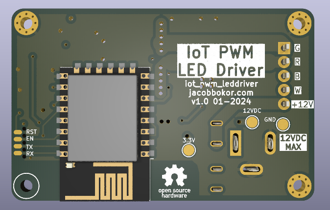

# IoT driver for Dumb 5050 RGB LED Strips
ESP8266-based LED Driver designed to work with WLED and cheap 12V barrel-jack power supplies for accent lighting around the home. 

***See [Releases](https://github.com/0xjmux/iot_pwm_leddriver/releases) for all the necessary files and information to make your own!***

### v1.0 - Redesigned
* complete Redesign, making my third time I've layed this out. 
* Uses mini blade fuses for protection and to avoid catching on fire
* Designed to handle up to maximum expected from RGBW strips
* 4 channels, to handle RGBW: or just multiple single-color strips
* Terminal block for easy end user use, with the 2.1mm jack allowing use of cheap 12V supplies you have lying around
* Capable of Programming and Debug over [SOICbite Connector](https://github.com/SimonMerrett/SOICbite).
* Status and power LED included, with overvoltage protection

### v0.1? - Quick Board Mock-up
* My first 4 layer board!
* but, the internal layers are kinda a mess to make everything fit :/
 

