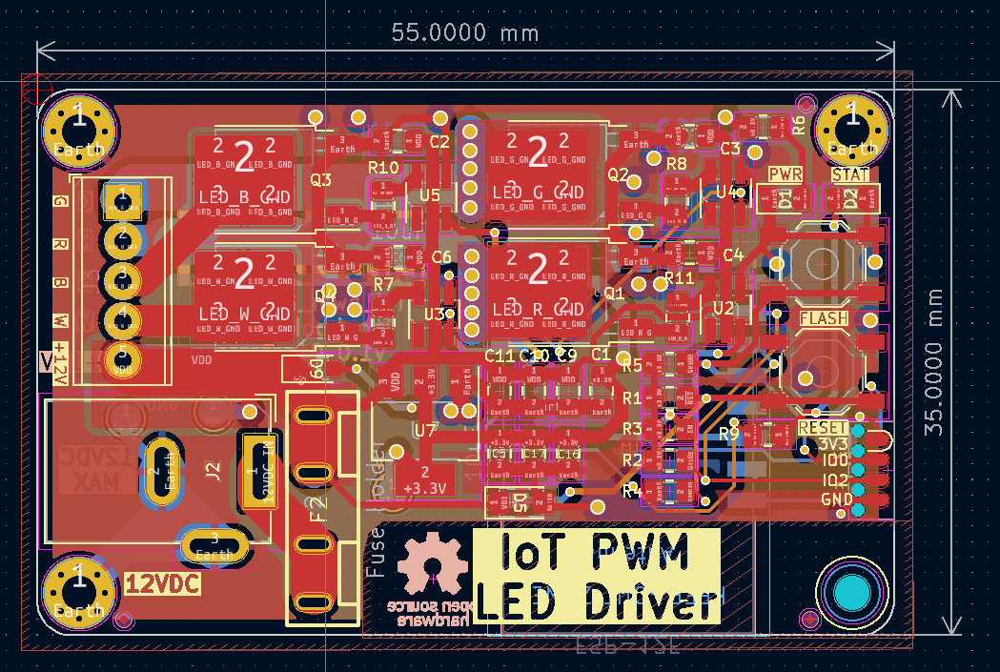

# IoT driver for Dumb 5050 RGB LED Strips
ESP8266-based LED Driver designed to work with WLED and cheap 12V barrel-jack power supplies for accent lighting around the home. 

* ***See [Releases](https://github.com/0xjmux/iot_pwm_leddriver/releases) for all the necessary files and information to make your own!***
* See [ABOUT.md](./ABOUT.md) for more information about design goals and the project. 

### v1.0 - Redesigned
* Complete redesign, with a focus on overall system design and ease of setup for the end user. 
* Uses mini blade fuses for overcurrent protection and to protect against fire hazard from shorts on bad quality LED strips
* Board designed to handle up to and above maximum expected from most LED strips (8A)
* 4 channels to handle RGBW: or up to 4 single-color strips
* Terminal block for ease of use connecting strips and a 2.1mm jack allowing use of cheap 12V supplies you have lying around
* Capable of both programming and debug over [SOICbite Connector](https://github.com/SimonMerrett/SOICbite).
* Status and power LED included, with overvoltage protection

### v0.1 - Quick Board Mock-up
* My first 4 layer board! But some improvement still possible
 

