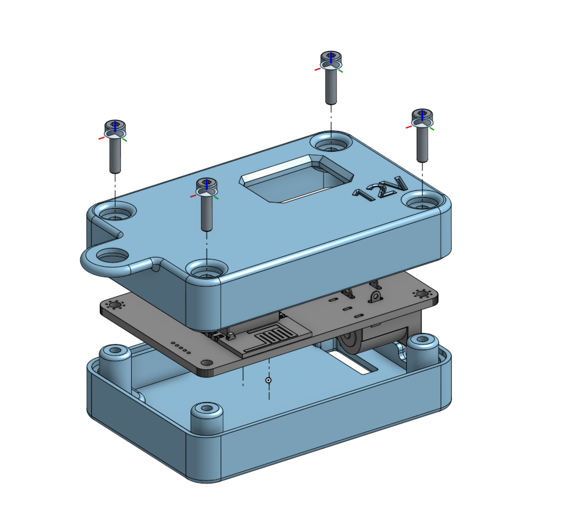
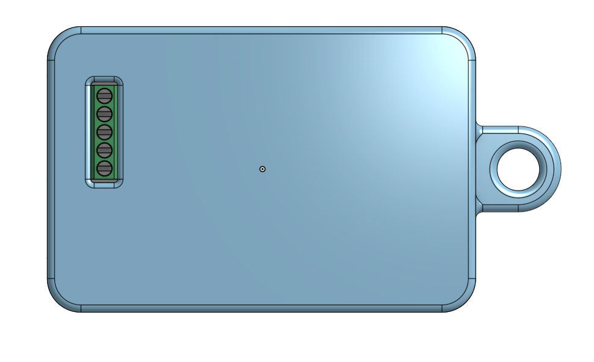
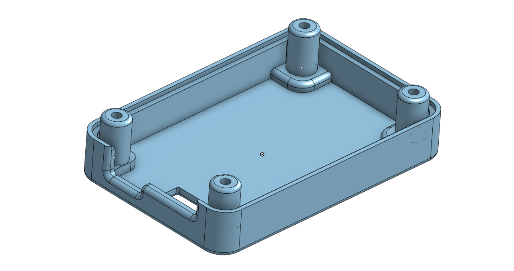
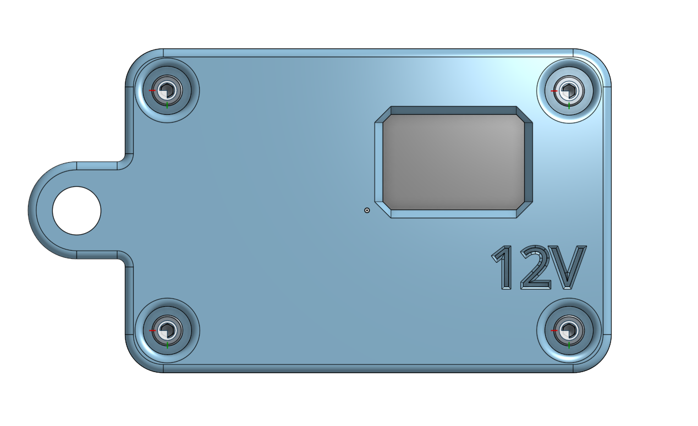
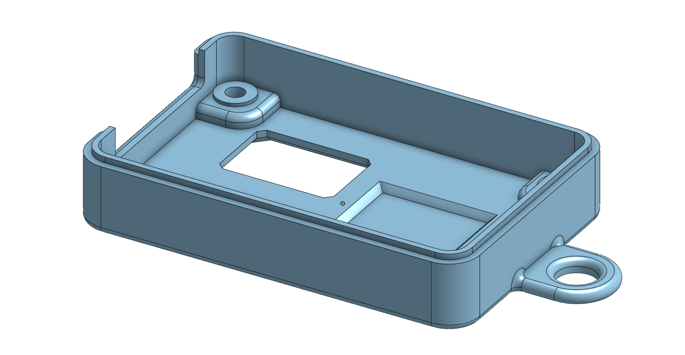

# PWM IoT LEDDriver Case

* Case is designed to be printed in PLA with 10% infill. Make sure both halves are oriented with their backs to the bed before clicking print. 

#### Top

#### Bottom

